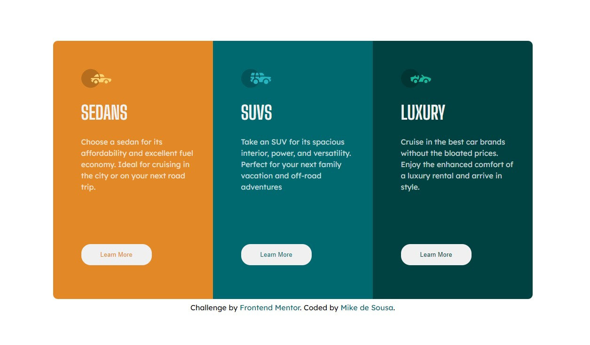

# Frontend Mentor - 3-column preview card component

## Overview

### The challenge

Users should be able to:

- View the optimal layout depending on their device's screen size
- See hover states for interactive elements

### Screenshot

### Links

- Solution URL: [Link](https://github.com/mikedsousa/Frontend-Mentor/tree/main/3-column%20preview%20card%20component)
- Live Site URL: [Link](https://reliable-dusk-5d8892.netlify.app)

### Built with

- Semantic HTML5 markup
- CSS custom properties
- Flexbox
- Mobile-first workflow

## Author

- LinkedIn - [Mike de Sousa](https://www.linkedin.com/in/mike-de-sousa/)
- Frontend Mentor - [@mikedsousa](https://www.frontendmentor.io/profile/mikedsousa)

